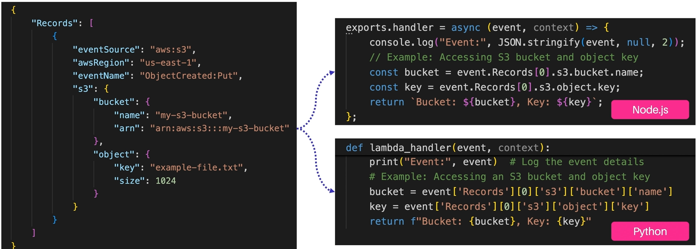
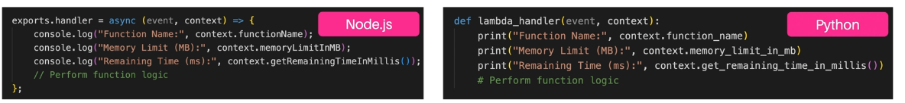

> # AWS Lambda, highlighting its role as a serverless computing service that allows developers to run code without the need to manage servers.

Functionality: AWS Lambda enables developers to write small, independent functions that are stateless and can be triggered by various events, such as file uploads, database updates, or API calls.

**Event-Driven Execution:** The focus is on event-driven execution, where functions are activated in response to specific events, facilitating efficient application responses.

**Stateless Nature:** Each function execution is independent, which allows AWS to scale functions automatically without developer intervention.

**Billing Model:** The pay-as-you-go billing model charges only for the time a function runs, measured in 100-millisecond increments, and incurs no costs during idle periods. There is also a free tier available for development and low-traffic applications.

**Permissions Model:** AWS Lambda's permissions model separates function policies and execution roles. Function policies control who can invoke the function, while execution roles define what resources the function can access, enhancing security.

**Conclusion and Next Steps:** The summary highlights that AWS Lambda allows for the creation of scalable and cost-effective applications, with the next session previewing a hands-on lab for creating a Lambda function and integrating it with other AWS services.

# invocation types for AWS Lambda, which are essential for building event-driven applications. Here’s a summary of the key points

1. Event Sources: Lambda can be triggered by multiple sources, enabling real-time responses. Important event sources include:

 - API Gateway: For building RESTful APIs.

 - S3: Triggers on file uploads for tasks like image processing.

 - DynamoDB Streams: Captures table changes for real-time updates.

 - Kinesis Streams: Enables real-time data analytics.

 - SNS and SQS: For broadcasting messages and asynchronous queuing.

 - Other integrations include EventBridge, Step Functions, Cognito, CloudWatch, and IoT events.

2. Invocation Types: The way Lambda functions interact with these sources is categorized into:

 - Synchronous Invocation: The caller waits for a response.

 - Asynchronous Invocation: The caller does not wait, suited for background tasks.

 - Event Source Mapping: Automatically scales based on data volume.

3. Function URLs: A new feature that allows direct HTTPS access to Lambda functions without an API Gateway, useful for creating webhooks, REST APIs, and prototypes with built-in security features.

> # Three essential components of AWS Lambda: event objects, context objects, and environment variables. These components are crucial for effectively interacting with and adapting Lambda functions
 **Event Object:** When a Lambda function is triggered, it receives an event object that contains information about the source event, such as S3, DynamoDB, or API Gateway. The structure of this object varies depending on the source. For example, an S3 event object includes a records array with details about the event's source, AWS region, bucket name, and object key. Code snippets in Node.js and Python demonstrate how to access these values for tasks like processing uploaded files.

 

 **Context Object:** This object provides metadata about the Lambda execution environment. It includes properties such as the **AWS request ID** for tracking, **log group** and stream names for locating logs in CloudWatch, the function name, memory limit, and a method to check the remaining execution time. This information helps manage function execution and allows for dynamic adjustments based on time constraints.

 

 **Environment Variables:** Environment variables allow configuration settings to be passed to Lambda functions without hardcoding values. This enhances the adaptability and portability of functions by referencing values like database connection strings or API keys. The use of IAM roles and KMS for security is also highlighted, with practical examples demonstrating how environment variables facilitate easier updates and environment-specific configurations.